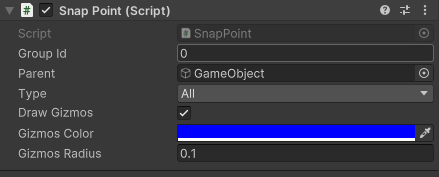
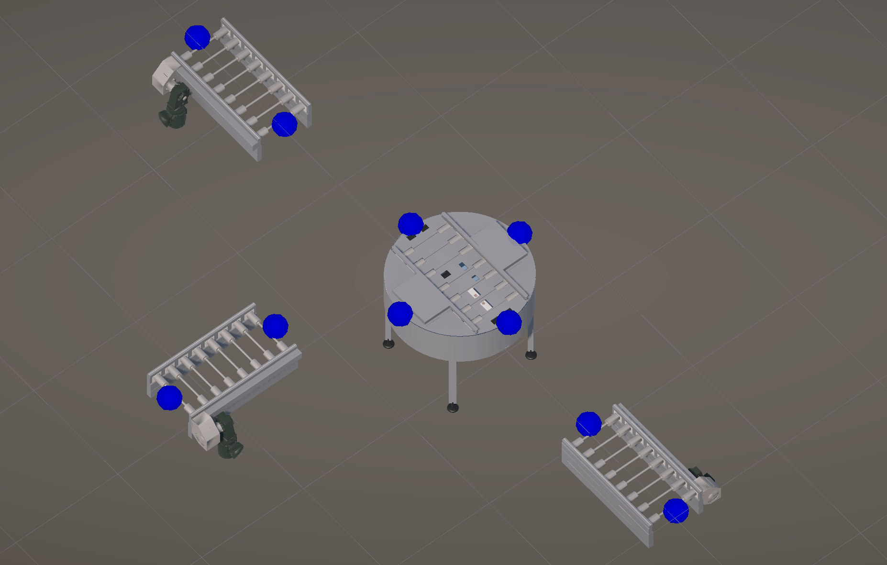

# Snapping Tool (Unity Editor)

A lightweight editor tool for snapping modular objects together via **SnappingPoints**.

---

## Overview
The **Snapping Tool** helps align modular objects in the Unity SceneView by snapping compatible points together with visual feedback.

- Toggle tool with **`S`** key.
- Drag **SnappingPoints** to nearby compatible points.
- Bezier lines show possible snap targets (white = near, green = snap-ready).
- Release **LMB** to snap and align automatically.

---

## Setup

1. **Add Components**

    - Attach `SnappingObject` to your modular prefab or GameObject.
    - Add one or more `SnappingPoint` children.
    - Set each point’s:
        - **SnapType:** `Plug`, `Slot`, or `None`
        - **GroupId:** to match compatible types
        - **Parent:** assigned automatically (used to prevent self-snapping)

2. **Activate Tool**
    - Select a `SnappingObject` in the scene.
    - Press **`S`** to toggle the **Snapping Tool**.
    - If no object is selected, pressing `S` restores your previous tool.

3. **Use**
    - Drag a `Plug` point in SceneView.
    - Hover near a compatible `Slot` (white line = search range, green line = snap range).
    - Release mouse to snap and align the objects.
   

---

## Snap Rules

A `Plug` point will snap to a `Slot` when:
- They have the **same GroupId**.
- They belong to **different parents**.
- The target point’s **SnapType** is not `Plug`.

---

## Constants

| Constant | Default | Description |
|-----------|----------|-------------|
| `RADIUS_SNAP` | 0.3 | Snap threshold |
| `RADIUS_SEARCH` | 1.0 | Search radius |
| `SNAP_TANGENT_LENGTH` | 1.0 | Bezier curve tangent scale |

---

## Tips
- Only **Plugs** can be dragged to snap.
- Keep `GroupId`s consistent between matching parts.
- Make sure your project includes `Transform.GetMatrix/SetMatrix(ignoreScale: true)` helpers.

---

**Shortcut:** `S`  
**Namespace:** `OC.Editor`  
**Tool Name:** *Snapping*  
**Icon:** `d_Cubemap Icon`

---
